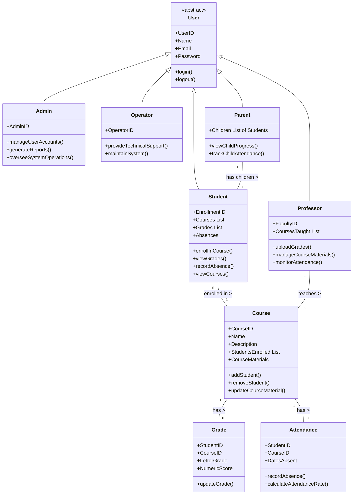

# [2024] SIWP2005 OOP Guide Study 
> This docs is a big picture of HW#1, HW#2, and Mid-Term Preparation
> 
# Case Study: Academic Information System
# Outline

> this is for HW#1
- Requirement analysis (FURPS)
- Use Case Stories
- Use Case Diagram
- Class Diagram

> this is for hw#2
- Translation into Code Development

## Requirement analysis
> will follow this FURPS approach

## Entitas, Actors 
(Student, Professor, Operator, Admin, parents)

## Functionality

- **Capability:** The system should support different user roles (students, professors, admin, operator, parents) with role-specific functionalities. For students, this might include viewing grades and course materials. Professors would need to post grades and course materials, admins oversee system operations, operators handle technical issues, and parents access student progress.

- **Reusability:** Components like user authentication, data retrieval, and notification services should be designed for reuse across different modules.

- **Security:** User authentication, data encryption, and access control are essential. Sensitive data like student records and grades must be securely managed.

## Usability

- **Human Factors:** The interface should be intuitive for all user types, accommodating varied tech proficiency. It should have a responsive design for different devices.
- **Consistency:** The system should maintain a consistent look and feel across all modules and user roles.
- **Documentation:** Comprehensive user guides for each user role, FAQs, and system manuals are necessary.

## Reliability

- **Availability:** The system should be available 24/7, with minimal downtime.
- **Failure Rate & Duration:** It should have a low failure rate. Any system failures should be resolved quickly.
- **Predictability:** System behavior in response to user actions should be predictable and consistent.

## Performance

**- Speed:** Fast response times for user queries and actions.
**- Efficiency:** Optimized for minimal resource consumption without compromising functionality.
**- Resource Consumption:** Should be optimized to work smoothly on standard institutional hardware.
**- Scalability:** Capable of handling an increasing number of users and data volume.


## Supportability

**- Testability:** The system should be easily testable to find and fix bugs.
**- Extensibility:** It should be designed to allow easy updates and additions of new features.
**- Serviceability:** Problems within the system should be easy to diagnose and fix.
**- Configurability:** Allow easy configuration of features like user roles, permissions, and system settings.

# Use Case and User Stories
> Use Case diagram will represent the interactions between various user roles and the system

### **User Roles (Actor)**
* Student (mahasiswa)
* Professor(Dosen)
* Operator(Tata Usaha)
* Admin (PTI)


### **User Stories (Functionalities)**
- student
    - enroll course
    - view grade
    - access course material
    - view schedule
    - you named it
- Professor
    - upload course
    - view course member
    - add grade
    - you named it 
- Admin
    - User management
    - systm monitoring
    - you named it
- Operator
    - Technical support
    - support dosen
    - support mahasiswa
    - daily operation
    - you named it

### Use Case Diagram
 > draw use case diagram base on the user stories (functionalities described)
 
 e.g 
 
 

# Class Diagram
> This diagram will outline the system's structure in terms of classes and their relationships.

- Main Classes: User, Course, Grade, Material, Notification, SystemSettings.
- User Class: Subclasses for Student, Professor, Admin, Operator, Parent.
- Relationships:
    - Users to Courses (enrollment, teaching).
    - Users to Grades (viewing, uploading).
    - Users to Materials (access, management).
- Attributes: Specific to each class, like user ID, course details, grade records.
- Methods: Functions like registerCourse(), uploadGrades(), generateReport().


### User (Abstract Class)
* Attributes: UserID, Name, Email, Password
* Methods: login(), logout()
### Student (Inherits User)
* Attributes: EnrollmentID, Courses (List), Grades (List), Absences
* Methods: enrollInCourse(), viewGrades(), recordAbsence(), viewCourses()
### Professor (Inherits User)
* Attributes: FacultyID, CoursesTaught (List)
* Methods: uploadGrades(), manageCourseMaterials(), monitorAttendance()

### Admin (Inherits User)

* Attributes: AdminID
* Methods: manageUserAccounts(), generateReports(), overseeSystemOperations()

### Operator (Inherits User)
* Attributes: OperatorID
* Methods: provideTechnicalSupport(), maintainSystem()

### Parent (Inherits User)
* Attributes: Children (List of Students)
* Methods: viewChildProgress(), trackChildAttendance()

### Course
* Attributes: CourseID, Name, Description, StudentsEnrolled (List), CourseMaterials
* Methods: addStudent(), removeStudent(), updateCourseMaterial()

### Grade
* Attributes: StudentID, CourseID, LetterGrade, NumericScore
* Methods: updateGrade()

### Attendance
* Attributes: StudentID, CourseID, DatesAbsent
* Methods: recordAbsence(), calculateAttendanceRate()

## Class Relationships
- Inheritance: Student, Professor, Admin, Operator, and Parent classes all inherit from the User class.

### Association:
* Students have an association with Courses and Grades.
* Professors have an association with Courses (they teach) and the Grades (they assign).
* Parents have an association with their children's academic records.
### Aggregation: 
- Course aggregates Students (as it contains a list of enrolled students) and CourseMaterials.




## Translate all to Code


#### Base Class
* User

#### Child Class (Can be Derived class) #Inheritance
* Admin
* Student
* Professor
* Operator


```python

# ## this Class can be seen as Abstraction
class User:
    def __init__(self, user_id, name, email, password):
        self.user_id = user_id
        self.name = name
        self.email = email
        self.password = password

    def login(self):
        # Login logic
        pass

    def logout(self):
        # Logout logic
        pass

# Derived Classes
class Student(User):
    def __init__(self, user_id, name, email, password, enrollment_id):
        super().__init__(user_id, name, email, password)
        self.enrollment_id = enrollment_id
        self.courses = []  # List of Course objects
        self.grades = []   # List of Grade objects
        self.absences = 0

    def enroll_in_course(self, course):
        # Logic to enroll in a course
        pass

    def view_grades(self):
        # Logic to view grades
        pass

    def record_absence(self):
        # Logic to record absence
        pass

    def view_courses(self):
        # Logic to view enrolled courses
        pass

class Professor(User):
    def __init__(self, user_id, name, email, password, faculty_id):
        super().__init__(user_id, name, email, password)
        self.faculty_id = faculty_id
        self.courses_taught = []  # List of Course objects

    def upload_grades(self):
        # Logic to upload grades
        pass

    def manage_course_materials(self):
        # Logic to manage course materials
        pass

    def monitor_attendance(self):
        # Logic to monitor attendance
        pass

class Admin(User):
    def __init__(self, user_id, name, email, password, admin_id):
        super().__init__(user_id, name, email, password)
        self.admin_id = admin_id

    def manage_user_accounts(self):
        # Logic for managing user accounts
        pass

    def generate_reports(self):
        # Logic for generating reports
        pass

    def oversee_system_operations(self):
        # Logic for overseeing system operations
        pass

class Operator(User):
    def __init__(self, user_id, name, email, password, operator_id):
        super().__init__(user_id, name, email, password)
        self.operator_id = operator_id

    def provide_technical_support(self):
        # Logic for providing technical support
        pass

    def maintain_system(self):
        # Logic for system maintenance
        pass

class Parent(User):
    def __init__(self, user_id, name, email, password):
        super().__init__(user_id, name, email, password)
        self.children = []  # List of Student objects

    def view_child_progress(self):
        # Logic to view child's academic progress
        pass

    def track_child_attendance(self):
        # Logic to track child's attendance
        pass
```

#### Others Class
- Course
- Grade
- Attandance
- etc. (you name it)

```python


# Other Classes
class Course:
    def __init__(self, course_id, name, description):
        self.course_id = course_id
        self.name = name
        self.description = description
        self.students_enrolled = []  # List of Student objects
        self.course_materials = []

    def add_student(self, student):
        # Logic to add a student
        pass

    def remove_student(self, student):
        # Logic to remove a student
        pass

    def update_course_material(self):
        # Logic to update course material
        pass

class Grade:
    def __init__(self, student_id, course_id, letter_grade, numeric_score):
        self.student_id = student_id
        self.course_id = course_id
        self.letter_grade = letter_grade
        self.numeric_score = numeric_score

    def update_grade(self):
        # Logic to update grade
        pass

class Attendance:
    def __init__(self, student_id, course_id, dates_absent):
        self.student_id = student_id
        self.course_id = course_id
        self.dates_absent = dates_absent  # List of dates

    def record_absence(self):
        # Logic to record absence
        pass

    def calculate_attendance_rate(self):
        # Logic to calculate attendance rate
        pass

```


### contoh penggunaan Abstraction dan Encapsulation
> Abstraction
> - User class provides a simple interface (login) and hides complex logic.
> Encapsulation
> - Attributes in User are private and accessed through methods
```python

# base class
"""
Base class biasa untuk sesuatu yang bersifat general
"""
class User:
    def __init__(self, user_id, name, email, password):
        self._user_id = user_id  # Encapsulation: Private attribute
        self._name = name
        self._email = email
        self._password = password

    def login(self, email, password):  # Abstraction: Login method
        if email == self._email and password == self._password:
            return True
        else:
            return False

    def get_user_id(self):  # Encapsulation: Accessor method
        return self._user_id
```


### 2. contoh Inheritance, Polymorphism
> what class can be inherited from base class User?

- Student(mahasiswa)
- Professor(dosen)
- Operator(TataUsaha)
- Admin

> Inheritance
> - Student, Professor, and Admin inherit from User

> Polymorphism
> - The create_user_account method in the Admin class demonstrates polymorphism by creating different types of users.

```python

class Student(User):
    def __init__(self, user_id, name, email, password, enrollment_id):
        super().__init__(user_id, name, email, password)
        self.enrollment_id = enrollment_id
        self.courses = []

    def enroll_in_course(self, course):
        self.courses.append(course)
        course.add_student(self)

class Professor(User):
    def __init__(self, user_id, name, email, password, faculty_id):
        super().__init__(user_id, name, email, password)
        self.faculty_id = faculty_id
        self.courses_taught = []

    def teach_course(self, course):
        self.courses_taught.append(course)

class Admin(User):
    def __init__(self, user_id, name, email, password):
        super().__init__(user_id, name, email, password)

    def create_user_account(self, user_type, *args):
        # Factory method to demonstrate Polymorphism
        if user_type == "student":
            return Student(*args)
        elif user_type == "professor":
            return Professor(*args)


```


### Course (simple example) 

```python

class Course:
    def __init__(self, course_id, name):
        self.course_id = course_id
        self.name = name
        self.students_enrolled = []

    def add_student(self, student):
        self.students_enrolled.append(student)
        
```

### Simple Polymorphism and Usage

```python

def main():
    admin = Admin("A1", "Monica", "monica@si.ukrida.ac.id", "adminpass")

    # instantiate
    student = admin.create_user_account("student", "S1", "peter", "peter@si.ukrida.ac.id", "studentpass", "E1234")
    student1 = admin.create_user_account("student1", "S2", "jesica", "jesica@si.ukrida.ac.id", "studentpass", "testtest")
    professor = admin.create_user_account("professor", "P1", "Dr. Endi", "example@ukrida.ac.id", "profpwd", "F5678")

    # Courses
    math_course = Course("C101", "Mathematics")
    science_course = Course("C102", "Science")

    # Enroll student and assign professor
    student.enroll_in_course(math_course)
    student1.enroll_in_course(science_course)
    professor.teach_course(science_course)

    # Polymorphism
    for user in [student, professor]:
        print(f"User {user.get_user_id()} can log in: {user.login(user._email, 'wrongpass')}")

if __name__ == "__main__":
    main()
    
# simple examples

```
    python3 tester.py
```

when you pass the password with 'studentpass' then you should be able to see similar to this
```
    User S1 can log in: True
    User S2 can log in: False
    User P1 can log in: False
```

it is because only student with user_id S1 is meet the criteria user can log in. you could always add more tester and feel free to extend it yourself


